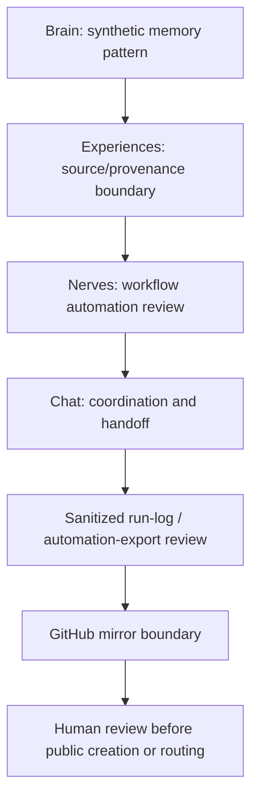

# Synthetic Engineering Operating-System Map

Status: scaffolded

## Problem Statement

Define a public-safe engineering operating-system map that shows how memory, source/provenance, workflow automation, operator review, chat coordination, run logs, and mirror decisions can be organized without production automation, endpoints, hostnames, ports, credentials, private vaults, private logs, private topology, customer operations, live automation exports, production workflows, private repo paths, or private telemetry.

## Synthetic Engineering Operating-System Context

The example is a synthetic engineering coordination system for mock review tasks. It has no live automation, production workflow, endpoint, credential, private vault, customer operation, private topology, private telemetry, private log, private repo path, or live automation export.

The purpose is to document public-safe operating discipline:

- where memory lives;
- where source/provenance lives;
- how automation is reviewed;
- how chat coordination remains non-authoritative;
- how run logs are sanitized;
- how GitHub mirror decisions require human review.

## Brain / Experiences / Nerves / Chat Pattern

| Pattern label | Synthetic role | Public-safe boundary |
| --- | --- | --- |
| Brain | Knowledge and memory organization | No private vaults, private logs, internal prompts, customer operations, or private repo paths |
| Experiences | Source/provenance and reviewed work records | No sealed source, production workflows, private topology, or credentials |
| Nerves | Workflow automation and task routing | No production automation, live automation exports, endpoints, hostnames, ports, or live tool tokens |
| Chat | Coordination and review discussion surface | No private logs, customer data, internal prompts, or authority beyond human review |

These are conceptual pattern labels, not internal company product names or active production systems.

## Obsidian / Forgejo / n8n / Mission Control Boundary

| Tool category | Public-safe use | Held out |
| --- | --- | --- |
| Obsidian-style memory | Synthetic knowledge categories and review notes | Private vaults, private logs, private prompts |
| Forgejo-style source/provenance | Canonical source and mirror discipline | Private repo paths, sealed source, production workflows |
| n8n-style workflow automation | Generic workflow diagrams and review checkpoints | Production automation, endpoints, credentials, live automation exports |
| Mission Control-style dashboard | Mock operator overview for review state | Production dashboards, live telemetry, customer operations |

## Private Mesh And GitHub Mirror Boundary

Private mesh concepts are described only as boundary categories. This artifact does not include hostnames, ports, endpoints, credentials, private topology, private telemetry, or private repo paths.

GitHub mirror notes are publication decisions only. They require human review, clean validation, and explicit approval before any remote, push, publication, or metadata change.

## Run-Log And Automation-Export Review Loop

1. Classify the run or export as public, private, sealed, or held.
2. Remove credentials, endpoints, hostnames, ports, private logs, private repo paths, customer operations, and private telemetry.
3. Confirm the example is synthetic or fully public-safe.
4. Run boundary validation and claim review.
5. Hold publication until human review approves the exact artifact.

## Source-Of-Truth Discipline

Canonical source and private/sealed materials remain outside this public-safe scaffold. Public mirrors are not canonical for private or sealed source. Chat summaries, run logs, and automation exports are not authority unless reviewed and accepted by a human.

## Mermaid Automation Review-Loop Diagram

## Validation Questions

- Does the artifact avoid production automation, live automation exports, production workflows, and live operations?
- Does it avoid endpoints, hostnames, ports, credentials, private topology, private telemetry, private logs, private vaults, and private repo paths?
- Are Brain / Experiences / Nerves / Chat framed as synthetic pattern labels only?
- Are Obsidian, Forgejo, n8n, and Mission Control framed as generic boundary categories rather than active production systems?
- Is source-of-truth authority kept separate from public mirrors and chat coordination?

## What This Proves

- A public-safe engineering operating-system map can name memory, provenance, automation, dashboard, mirror, run-log, and review-loop categories.
- Automation and mirror decisions can be discussed with explicit human review and boundary classification.
- Synthetic coordination patterns can be documented without exposing topology, credentials, logs, endpoints, or production workflows.

## What This Does Not Prove

- It does not prove production automation, live operations, deployed dashboards, private mesh deployment, or active workflow execution.
- It does not expose endpoints, hostnames, ports, credentials, private vaults, private logs, private topology, customer operations, production workflows, private repo paths, or private telemetry.
- It does not authorize public creation, remotes, pushes, metadata changes, routing, publication, or release.

## Public / Private / Sealed Checklist

| Check | Status |
| --- | --- |
| Status: scaffolded | yes |
| Synthetic engineering operating-system context only | yes |
| No production automation, live automation exports, or production workflows | yes |
| No endpoints, hostnames, ports, credentials, or live tool tokens | yes |
| No private vaults, private logs, private repo paths, private topology, or private telemetry | yes |
| No customer operations or Foundation-private data | yes |
| Source-of-truth and mirror decisions require human review | yes |
| Profile routing and proof-stack routing remain planned | yes |
